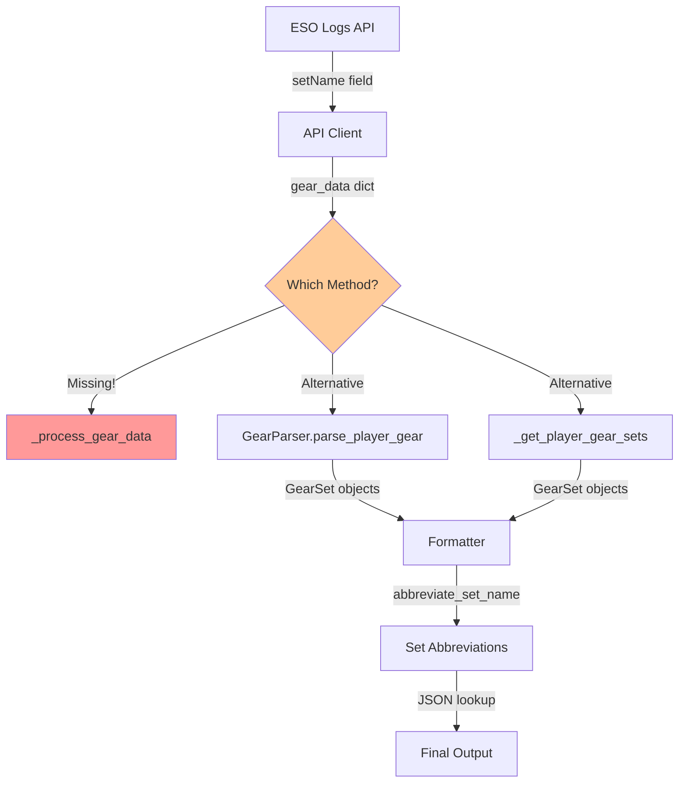

# Deep Analysis: The Set Abbreviation System - Problems and Unknowns

## Executive Summary

The set abbreviation system in the ESO Top Builds tool has several critical issues that need immediate attention. While the abbreviation functionality works correctly for known sets, there are fundamental problems with set name discovery, processing, and handling of unknown sets.

## Critical Issues Identified

### 1. **Missing Method: `_process_gear_data`**

**Problem**: The code calls `self._process_gear_data(gear_data)` on line 381 of `src/eso_builds/api_client.py`, but this method does not exist.

**Impact**: This causes a runtime error when processing gear data, preventing the system from extracting set information from the API.

**Location**: 
- **Called**: `src/eso_builds/api_client.py:381`
- **Missing**: Method definition not found anywhere in the codebase

**Evidence**:
```python
# Line 381 in api_client.py
gear_sets = self._process_gear_data(gear_data)
```

**Root Cause**: During the transition from web scraping to API-based data extraction, the `_process_gear_data` method was referenced but never implemented.

### 2. **Inconsistent Gear Processing Architecture**

**Problem**: There are multiple, conflicting approaches to gear processing in the codebase:

1. **API Client Approach**: Calls non-existent `_process_gear_data` method
2. **Gear Parser Approach**: Uses `GearParser.parse_player_gear()` method  
3. **Player Gear Sets Approach**: Uses `_get_player_gear_sets()` method

**Evidence**:
- `api_client.py:381`: `gear_sets = self._process_gear_data(gear_data)`
- `api_client.py:478`: `gear_sets = parser.parse_player_gear(gear_data)`
- `gear_parser.py:40`: `def parse_player_gear(self, player_data: Dict[str, Any]) -> List[GearSet]:`

**Impact**: This creates confusion about which method should be used and leads to inconsistent gear processing.

### 3. **Set Name Source Uncertainty**

**Problem**: The origin of set names in the system is unclear and potentially inconsistent.

**Current Flow**:
1. API returns gear data with `setName` field
2. `GearParser` processes this data into `GearSet` objects
3. `MarkdownFormatter`/`DiscordFormatter` apply abbreviations via `abbreviate_set_name()`

**Unknowns**:
- Are set names coming directly from the ESO Logs API?
- Are they being processed/cleaned by the `GearParser`?
- Are there multiple sources of set names that could conflict?

**Evidence from API Response Structure**:
```python
# From api_client.py lines 374-378
gear_data['gear'].append({
    'setID': gear_item.get('setID'),
    'setName': gear_item.get('setName'),  # Direct from API
    'slot': gear_item.get('slot', 'unknown')
})
```

### 4. **Abbreviation System Limitations**

**Problem**: The current abbreviation system has several limitations:

**Current Implementation**:
- Static JSON file (`set_abbreviations.json`) with 16 hardcoded mappings
- Only handles exact string matches
- No handling of variations or partial matches
- No fallback for unknown sets

**Limitations**:
1. **Exact Match Only**: `"Ansuul's Torment": "Ansuul"` only works for exact string
2. **No Variations**: Doesn't handle "Perfected Ansuul's Torment" vs "Ansuul's Torment"
3. **No Partial Matching**: Can't handle slight variations in naming
4. **Manual Maintenance**: Requires manual updates for new sets
5. **No Discovery**: No way to identify unknown sets that need abbreviations

### 5. **Unknown Set Detection Gap**

**Problem**: There's no mechanism to identify sets that don't have abbreviations.

**Missing Features**:
- No logging of unknown sets encountered
- No way to track which sets are frequently seen but not abbreviated
- No automatic suggestion system for new abbreviations
- No validation that all sets in reports have abbreviations

**Impact**: Sets without abbreviations display with full names, making reports verbose and inconsistent.

## Technical Deep Dive

### Set Name Processing Flow Analysis



### Data Structure Analysis

**GearSet Model** (`src/eso_builds/models.py:29-38`):
```python
@dataclass
class GearSet:
    name: str                    # Full set name from API
    piece_count: int             # Number of pieces (5, 7, etc.)
    is_perfected: bool = False   # Perfected version flag
    max_pieces: int = 5          # Maximum pieces for set
    is_incomplete: bool = False  # Incomplete set flag
```

**Abbreviation System** (`src/eso_builds/set_abbreviations.py`):
```python
def abbreviate_set_name(full_name: str) -> str:
    # Remove "Perfected " prefix before lookup
    clean_name = full_name.replace("Perfected ", "")
    return _ABBREVIATIONS.get(clean_name, full_name)
```

### Current Abbreviation Mappings

The system currently handles 16 sets:

| Full Name | Abbreviation | Notes |
|-----------|-------------|-------|
| Ansuul's Torment | Ansuul | Shortened |
| Velothi Ur-Mage's Amulet | Velothi | Shortened |
| Symphony of Blades | Symphony | Shortened |
| Ozezan the Inferno | Ozezan | Shortened |
| Slivers of the Null Arca | Null Arca | Shortened |
| Deadly Strike | Deadly | Shortened |
| Pillager's Profit | Pillager | Shortened |
| Pearlescent Ward | Pearlescent | Shortened |
| Roaring Opportunist | RO | Acronym |
| Jorvuld's Guidance | JO | Acronym |
| Powerful Assault | PA | Acronym |
| Azureblight Reaper | Azureblight | Shortened |
| Tide-Born Wildstalker | Tide-Born | Shortened |
| Spell Power Cure | SPC | Acronym |
| Berserking Warrior | AY | Very short |
| Sul-Xan's Torment | Sul-Xan | Shortened |

## Recommendations

### Immediate Fixes (Critical)

1. **Implement Missing Method**: Create `_process_gear_data` method or fix the method call
2. **Standardize Gear Processing**: Choose one consistent approach for gear processing
3. **Add Error Handling**: Handle cases where gear data is missing or malformed

### Medium-term Improvements

1. **Unknown Set Detection**: Add logging to identify sets without abbreviations
2. **Abbreviation Suggestions**: Create a system to suggest abbreviations for unknown sets
3. **Validation System**: Ensure all sets in reports have appropriate abbreviations

### Long-term Enhancements

1. **Dynamic Abbreviation System**: Automatically generate abbreviations for new sets
2. **Set Name Normalization**: Handle variations in set names (Perfected vs non-Perfected)
3. **Community-driven Abbreviations**: Allow users to suggest and vote on abbreviations

## Testing Recommendations

1. **Unit Tests**: Test the missing `_process_gear_data` method
2. **Integration Tests**: Test gear processing end-to-end
3. **Abbreviation Tests**: Test abbreviation system with various set name formats
4. **Unknown Set Tests**: Test behavior when encountering unknown sets

## Conclusion

The set abbreviation system has a solid foundation but suffers from critical implementation gaps and architectural inconsistencies. The most urgent issue is the missing `_process_gear_data` method, which prevents the system from functioning correctly. Once this is resolved, the system can be enhanced with better unknown set detection and more robust abbreviation handling.

The current approach of manual abbreviation management is sustainable for a small set of common gear sets, but will become increasingly difficult to maintain as the game adds new sets. A more dynamic approach should be considered for long-term sustainability.
